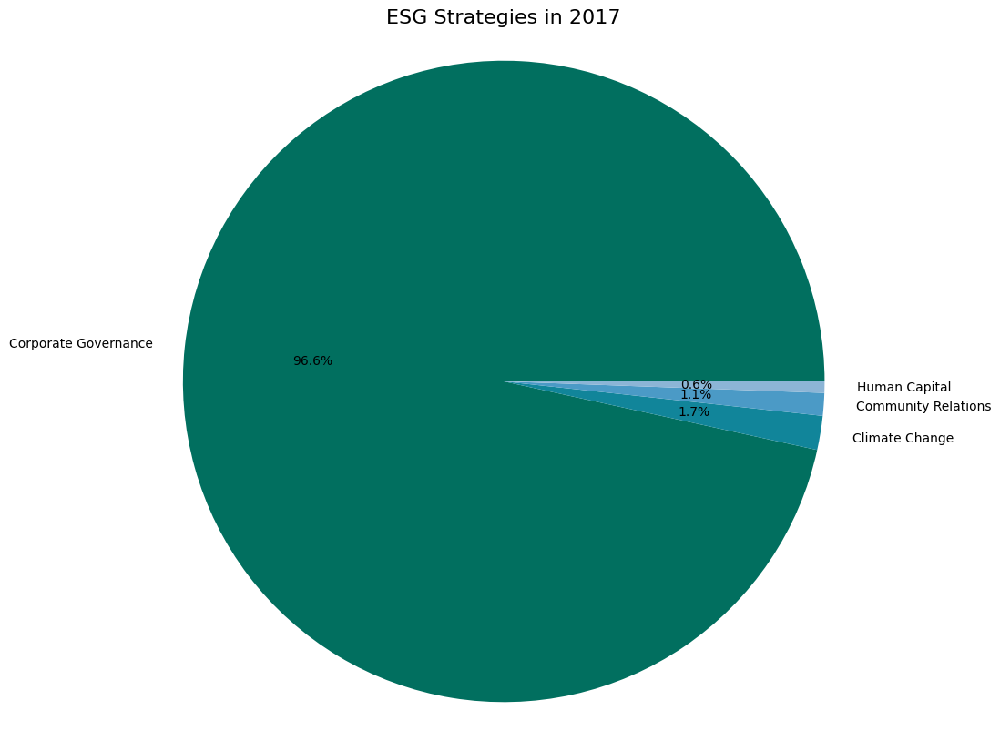

# Mutual-Fund-ESG-Investment-Trends
📕HKU Mfft 21'fall-Big Data. Contributors: Diana LI @Diana-LI-Zhaozhen, Peng Pengxin. We were trying to find ESG investment trends by applying basic EDA on the prospectus of mutual funds in the States. The project and the course was instructed by Dr. Alan Kwan.

# Background

A growing number of funds claim to be making sustainable investments, while investors are concerned about the risks associated with greenwashing due to the current lack of measurable standards in this area. Although there are several ESG scoring metrics proposed by rating agencies , these data are very scarce and expensive and the sources are often not transparent or objective enough, which sets a very high barrier for investors and greatly hinders relevant investments.

We believe that NLP could be useful in ESG investment strategy analysis, as such information is often presented in textual form in prospectuses, related news reports, and speeches. NLP can enhance ESG investing in a variety of ways. For example, NLP enables the large-scale tracking of controversies. Also, NLP can be combined with graph analytics to extract key strategic ESG initiatives and learn companies’ relationships in a global market and their impact on market risk calculations (Amend, A Data-driven Approach to Environmental, Social and Governance, 2020). (Vamvourellis, Toth, Desai, Mehta, & Pasquali, 2022)

# Methodology and Findings

In this project, we attempted to classify mutual funds by utilizing the FinBERT model. Then, we explored the trend of esg investment development based on the classification results. Additionally, we tried to perform feature extracting and topic modeling from the texts to construct a new ESG investment strategy taxonomy.

## 1. Labelling and Building Database

We pulled data from the table derived_sec_fund_characteristic in database common_goods to construct our own database. This table contains raw texts extracted from 13-F files. After filtering out the Null&NaN data, we can get 1600 files submitted by 1436 funds covering reporting periods from 2015 Q4 to 2022 Q2. After removing the duplicates, we get a sample of 6519 observations. This is a relatively small sample with many highly resemble objective and strategies description (Amend, A Data-driven Approach to Environmental, Social and Governance, 2020)ns, suggesting that we should use Zero-Shot-Learning or Few-Shot-Learning techniques in the classification. Also, we contacted the cleaned text string of objective and strategy to power the analysis. 

Next, the ESG-FinBERT model  pertained by researchers at HKUST is adopted to label the contacted objectives and strategies strings. The model could classify raw text into 9 categories: Climate Change, Pollution & Waste, Corporate Governance, Natural Capital, Product Liability, Human Capital, Business Ethics &Values, Community Relations and Non-ESG. According to researchers, their pretrained ESG-FinBERT model outperforms other NLP models when doing ESG classification, especially when training on smaller text samples containing financial words that are not commonly used in general texts. (Huang, Wang, & Yang, 2022) Another study (Pasch & Ehnes, 2022) also shows preference for BERT model when doing ESG classification tasks. However, this model is not perfect since is pre-trained, which means we should bear with the inflexibility. And though both researches mentioned that the models used were trained on ESG-related corpus, mainly news and listed companies’ ESG reports, our corpus does not necessarily feature overlapping features. To get better classification results, we should have fine-tuned the pretrained model.

The labelled data was stored in our database as table fund_objectives_strategy_with_labels in database common_goods.

<table class="MsoTable15Plain2" border="1" cellspacing="0" cellpadding="0" width="100%" style="width:100.0%;border-collapse:collapse;border:none">
 <tbody><tr style="height:14.65pt">
  <td width="228" style="width:170.9pt;border-top:solid black 1.5pt;border-left:
  none;border-bottom:solid black 1.5pt;border-right:none;padding:0cm 5.4pt 0cm 5.4pt;
  height:14.65pt">
  
N<b>ame</b>

  </td>
  <td width="186" style="width:139.2pt;border-top:solid black 1.5pt;border-left:
  none;border-bottom:solid black 1.5pt;border-right:none;padding:0cm 5.4pt 0cm 5.4pt;
  height:14.65pt">
  
<b>Data Type</b>

  </td>
  <td width="208" style="width:155.75pt;border-top:solid black 1.5pt;border-left:
  none;border-bottom:solid black 1.5pt;border-right:none;padding:0cm 5.4pt 0cm 5.4pt;
  height:14.65pt">
  
<b>Description</b>

  </td>
 </tr>
 <tr style="height:14.1pt">
  <td width="228" style="width:170.9pt;border:none;padding:0cm 5.4pt 0cm 5.4pt;
  height:14.1pt">
  
<b>adsh</b>

  </td>
  <td width="186" style="width:139.2pt;border:none;padding:0cm 5.4pt 0cm 5.4pt;
  height:14.1pt">
  
Nullable(String)

  </td>
  <td width="208" style="width:155.75pt;border:none;padding:0cm 5.4pt 0cm 5.4pt;
  height:14.1pt">
  
Filing id, SEC Accession No.

  </td>
 </tr>
 <tr style="height:14.65pt">
  <td width="228" style="width:170.9pt;border:none;padding:0cm 5.4pt 0cm 5.4pt;
  height:14.65pt">
  
<b>cik_expanded</b>

  </td>
  <td width="186" style="width:139.2pt;border:none;padding:0cm 5.4pt 0cm 5.4pt;
  height:14.65pt">
  
Nullable(String)

  </td>
  <td width="208" style="width:155.75pt;border:none;padding:0cm 5.4pt 0cm 5.4pt;
  height:14.65pt">
  
The Central Index Key (CIK)

  </td>
 </tr>
 <tr style="height:14.65pt">
  <td width="228" style="width:170.9pt;border:none;padding:0cm 5.4pt 0cm 5.4pt;
  height:14.65pt">
  
<b>name</b>

  </td>
  <td width="186" style="width:139.2pt;border:none;padding:0cm 5.4pt 0cm 5.4pt;
  height:14.65pt">
  
Nullable(String)

  </td>
  <td width="208" style="width:155.75pt;border:none;padding:0cm 5.4pt 0cm 5.4pt;
  height:14.65pt">
  
Fund name

  </td>
 </tr>
 <tr style="height:14.1pt">
  <td width="228" style="width:170.9pt;border:none;padding:0cm 5.4pt 0cm 5.4pt;
  height:14.1pt">
  
<b>period_end_date</b>

  </td>
  <td width="186" style="width:139.2pt;border:none;padding:0cm 5.4pt 0cm 5.4pt;
  height:14.1pt">
  
Nullable(Int32)

  </td>
  <td width="208" style="width:155.75pt;border:none;padding:0cm 5.4pt 0cm 5.4pt;
  height:14.1pt">
  
Reporting period end date

  </td>
 </tr>
 <tr style="height:14.65pt">
  <td width="228" style="width:170.9pt;border:none;padding:0cm 5.4pt 0cm 5.4pt;
  height:14.65pt">
  
<b>year</b>

  </td>
  <td width="186" style="width:139.2pt;border:none;padding:0cm 5.4pt 0cm 5.4pt;
  height:14.65pt">
  
Int32

  </td>
  <td width="208" style="width:155.75pt;border:none;padding:0cm 5.4pt 0cm 5.4pt;
  height:14.65pt">
  
Reporting period year

  </td>
 </tr>
 <tr style="height:14.1pt">
  <td width="228" style="width:170.9pt;border:none;padding:0cm 5.4pt 0cm 5.4pt;
  height:14.1pt">
  
<b>objective</b>

  </td>
  <td width="186" style="width:139.2pt;border:none;padding:0cm 5.4pt 0cm 5.4pt;
  height:14.1pt">
  
Nullable(String)

  </td>
  <td width="208" style="width:155.75pt;border:none;padding:0cm 5.4pt 0cm 5.4pt;
  height:14.1pt">
  
Objective narrative

  </td>
 </tr>
 <tr style="height:14.65pt">
  <td width="228" style="width:170.9pt;border:none;padding:0cm 5.4pt 0cm 5.4pt;
  height:14.65pt">
  
<b>strategy</b>

  </td>
  <td width="186" style="width:139.2pt;border:none;padding:0cm 5.4pt 0cm 5.4pt;
  height:14.65pt">
  
Nullable(String)

  </td>
  <td width="208" style="width:155.75pt;border:none;padding:0cm 5.4pt 0cm 5.4pt;
  height:14.65pt">
  
Strategy narrative

  </td>
 </tr>
 <tr style="height:14.1pt">
  <td width="228" style="width:170.9pt;border:none;padding:0cm 5.4pt 0cm 5.4pt;
  height:14.1pt">
  
<b>cleaned_objective_strategy</b>

  </td>
  <td width="186" style="width:139.2pt;border:none;padding:0cm 5.4pt 0cm 5.4pt;
  height:14.1pt">
  
Nullable(String)

  </td>
  <td width="208" style="width:155.75pt;border:none;padding:0cm 5.4pt 0cm 5.4pt;
  height:14.1pt">
  
Contacted string of cleaned 

  </td>
 </tr>
 <tr style="height:14.65pt">
  <td width="228" style="width:170.9pt;border:none;border-bottom:solid black 1.5pt;
  padding:0cm 5.4pt 0cm 5.4pt;height:14.65pt">
  
<b>esg_labels</b>

  </td>
  <td width="186" style="width:139.2pt;border:none;border-bottom:solid black 1.5pt;
  padding:0cm 5.4pt 0cm 5.4pt;height:14.65pt">
  
Nullable(String)

  </td>
  <td width="208" style="width:155.75pt;border:none;border-bottom:solid black 1.5pt;
  padding:0cm 5.4pt 0cm 5.4pt;height:14.65pt">
  
ESG labels assigned by ESG FinBERT
  model.

  </td>
 </tr>
</tbody></table>

## 2. Exploratory Data Analysis

After filtering out abnormal and meaningless data and only keep the last entries, we still have 1583 observations. These observations cover the reporting period from consecutive 8 years from 2015 to 2022, and are labelled as 6 categories: Corporate Governance, Community Relations, Natural Capital, Climate Change, Human Capital and Non-ESG. Labels not covered in our samples are: Pollution & Waste, Product Liability and Business Ethics & Values. 

Based on the results in the previous section, we further explored around the data. We focus on the trend of both ESG labelled strategies and funds and also the top names’ participation in ESG. Below are some of our findings. Details and illustrative figures could be found in Appendixes and codebook.

### *2.1 trend of esg-labelled strategies.*

Total Number of ESG-labelled strategies peaked in 2017. The number of strategies labelled as ESG -related does not exceed 20 in most years, but in 2017 it reached a whopping 180. Most of the ESG-labeled strategies in 2017 are labeled as Corporate Governance accounted for 96.6% of the total strategies in 2017, with the remaining divided by Climate Change (1.7%), Community Relations (1.1%) and Human Capital (0.6%). Through the trend chart analysis, it can be concluded that the proportion of ESG-related strategies is decreasing year by year from 2015 to 2022.         By further checking each Corporate Governance strategy manually, we found that most these are actually not really trading with corporate governance factors but rather more general descriptions. Thus, we believe that it is an outlier caused by misclassification.

Percentage of ESG-labelled strategies in 2015 is the highest. We surprisingly found that the percentage of ESG-labelled strategies was highest in 2015.    But this is due to the denominator effect, i.e., there are too few observations in 2015. Therefore, it is fair to exclude the data of the year 2015. Then, we get an slightly upward-sloping regression line of the percentage of ESG-labelled strategies.   

Environmental and Social Factors are trending these years. Grouped by the ESG labels, we find that Corporate Governance strategies dominates till 2019.     While the number of strategies labelled as Climate Change, Community Relations and Human Capital climb up year by year after a slight decline in 2017 and increase significantly from 2021.     We can see that fund management has been on the radar of investors and COVID-19 epidemic has increased investors' attention to the funds’ sustainability and corporate social responsibility.

### *2.2 trend of esg-labelled funds.*

In terms of ESG-labelled funds, we see trends similar to the ESG strategy mentioned above. More and more funds are integrating ESG into their investments in the recent years.          According to the Sustainable and Socially Responsible Investment Forum (US SIF, 2023), the total ESG investment in the U.S. market in 2016 has reached 8.7 trillion US dollars, an increase of 33% over 2014, and ESG ETFs still have a large space for growth. The overall development of ESG was in good shape.

### *2.3 leaders in esg investments.*

We then look at some the top names in ESG investing. We get the first movers’ names. Corporate Governance strategies are not inspected since they are much more general strategies. We can see that most of the ESG-related strategies start from 2016.

<table class="MsoNormalTable" border="0" cellspacing="0" cellpadding="0" width="99%" style="width:99.24%;border-collapse:collapse">
 <thead>
  <tr style="height:13.85pt">
   <td width="104" nowrap="" style="width:78.0pt;border-top:solid black 1.5pt;
   border-left:none;border-bottom:solid black 1.5pt;border-right:none;
   padding:0cm 5.4pt 0cm 5.4pt;height:13.85pt">
   
<b>Labels</b>

   </td>
   <td width="85" nowrap="" style="width:63.8pt;border-top:solid black 1.5pt;
   border-left:none;border-bottom:solid black 1.5pt;border-right:none;
   padding:0cm 5.4pt 0cm 5.4pt;height:13.85pt">
   
<b>CIK</b>

   </td>
   <td width="359" nowrap="" style="width:269.3pt;border-top:solid black 1.5pt;
   border-left:none;border-bottom:solid black 1.5pt;border-right:none;
   padding:0cm 5.4pt 0cm 5.4pt;height:13.85pt">
   
<b>Fund Name</b>

   </td>
   <td width="49" nowrap="" style="width:36.45pt;border-top:solid black 1.5pt;
   border-left:none;border-bottom:solid black 1.5pt;border-right:none;
   padding:0cm 5.4pt 0cm 5.4pt;height:13.85pt">
   
<b>Year</b>

   </td>
  </tr>
 </thead>
 <tbody><tr style="height:13.85pt">
  <td width="104" nowrap="" rowspan="14" style="width:78.0pt;border:none;border-bottom:
  solid black 1.0pt;padding:0cm 5.4pt 0cm 5.4pt;height:13.85pt">
  
Climate Change

  </td>
  <td width="85" nowrap="" style="width:63.8pt;border:none;padding:0cm 5.4pt 0cm 5.4pt;
  height:13.85pt">
  
1579982

  </td>
  <td width="359" nowrap="" style="width:269.3pt;border:none;padding:0cm 5.4pt 0cm 5.4pt;
  height:13.85pt">
  
ARK ETF TRUST

  </td>
  <td width="49" nowrap="" style="width:36.45pt;border:none;padding:0cm 5.4pt 0cm 5.4pt;
  height:13.85pt">
  
2016

  </td>
 </tr>
 <tr style="height:13.85pt">
  <td width="85" nowrap="" style="width:63.8pt;padding:0cm 5.4pt 0cm 5.4pt;
  height:13.85pt">
  
1738074

  </td>
  <td width="359" nowrap="" style="width:269.3pt;padding:0cm 5.4pt 0cm 5.4pt;
  height:13.85pt">
  
BLACKROCK FUNDS IV

  </td>
  <td width="49" nowrap="" style="width:36.45pt;padding:0cm 5.4pt 0cm 5.4pt;
  height:13.85pt">
  
2016

  </td>
 </tr>
 <tr style="height:13.85pt">
  <td width="85" nowrap="" style="width:63.8pt;padding:0cm 5.4pt 0cm 5.4pt;
  height:13.85pt">
  
110055

  </td>
  <td width="359" nowrap="" style="width:269.3pt;padding:0cm 5.4pt 0cm 5.4pt;
  height:13.85pt">
  
BLACKROCK SUSTAINABLE
  BALANCED FUND, INC.

  </td>
  <td width="49" nowrap="" style="width:36.45pt;padding:0cm 5.4pt 0cm 5.4pt;
  height:13.85pt">
  
2016

  </td>
 </tr>
 <tr style="height:13.85pt">
  <td width="85" nowrap="" style="width:63.8pt;padding:0cm 5.4pt 0cm 5.4pt;
  height:13.85pt">
  
1324285

  </td>
  <td width="359" nowrap="" style="width:269.3pt;padding:0cm 5.4pt 0cm 5.4pt;
  height:13.85pt">
  
BLACKROCK UNCONSTRAINED
  EQUITY FUND

  </td>
  <td width="49" nowrap="" style="width:36.45pt;padding:0cm 5.4pt 0cm 5.4pt;
  height:13.85pt">
  
2016

  </td>
 </tr>
 <tr style="height:13.85pt">
  <td width="85" nowrap="" style="width:63.8pt;padding:0cm 5.4pt 0cm 5.4pt;
  height:13.85pt">
  
1121624

  </td>
  <td width="359" nowrap="" style="width:269.3pt;padding:0cm 5.4pt 0cm 5.4pt;
  height:13.85pt">
  
CALVERT IMPACT FUND INC

  </td>
  <td width="49" nowrap="" style="width:36.45pt;padding:0cm 5.4pt 0cm 5.4pt;
  height:13.85pt">
  
2016

  </td>
 </tr>
 <tr style="height:13.85pt">
  <td width="85" nowrap="" style="width:63.8pt;padding:0cm 5.4pt 0cm 5.4pt;
  height:13.85pt">
  
1831313

  </td>
  <td width="359" nowrap="" style="width:269.3pt;padding:0cm 5.4pt 0cm 5.4pt;
  height:13.85pt">
  
ENGINE NO. 1 ETF TRUST

  </td>
  <td width="49" nowrap="" style="width:36.45pt;padding:0cm 5.4pt 0cm 5.4pt;
  height:13.85pt">
  
2016

  </td>
 </tr>
 <tr style="height:13.85pt">
  <td width="85" nowrap="" style="width:63.8pt;padding:0cm 5.4pt 0cm 5.4pt;
  height:13.85pt">
  
1467831

  </td>
  <td width="359" nowrap="" style="width:269.3pt;padding:0cm 5.4pt 0cm 5.4pt;
  height:13.85pt">
  
ETF MANAGERS TRUST

  </td>
  <td width="49" nowrap="" style="width:36.45pt;padding:0cm 5.4pt 0cm 5.4pt;
  height:13.85pt">
  
2016

  </td>
 </tr>
 <tr style="height:13.85pt">
  <td width="85" nowrap="" style="width:63.8pt;padding:0cm 5.4pt 0cm 5.4pt;
  height:13.85pt">
  
917124

  </td>
  <td width="359" nowrap="" style="width:269.3pt;padding:0cm 5.4pt 0cm 5.4pt;
  height:13.85pt">
  
FIRSTHAND FUNDS

  </td>
  <td width="49" nowrap="" style="width:36.45pt;padding:0cm 5.4pt 0cm 5.4pt;
  height:13.85pt">
  
2016

  </td>
 </tr>
 <tr style="height:13.85pt">
  <td width="85" nowrap="" style="width:63.8pt;padding:0cm 5.4pt 0cm 5.4pt;
  height:13.85pt">
  
877232

  </td>
  <td width="359" nowrap="" style="width:269.3pt;padding:0cm 5.4pt 0cm 5.4pt;
  height:13.85pt">
  
GREEN CENTURY FUNDS

  </td>
  <td width="49" nowrap="" style="width:36.45pt;padding:0cm 5.4pt 0cm 5.4pt;
  height:13.85pt">
  
2016

  </td>
 </tr>
 <tr style="height:13.85pt">
  <td width="85" nowrap="" style="width:63.8pt;padding:0cm 5.4pt 0cm 5.4pt;
  height:13.85pt">
  
1100663

  </td>
  <td width="359" nowrap="" style="width:269.3pt;padding:0cm 5.4pt 0cm 5.4pt;
  height:13.85pt">
  
ISHARES TRUST

  </td>
  <td width="49" nowrap="" style="width:36.45pt;padding:0cm 5.4pt 0cm 5.4pt;
  height:13.85pt">
  
2016

  </td>
 </tr>
 <tr style="height:13.85pt">
  <td width="85" nowrap="" style="width:63.8pt;padding:0cm 5.4pt 0cm 5.4pt;
  height:13.85pt">
  
1095726

  </td>
  <td width="359" nowrap="" style="width:269.3pt;padding:0cm 5.4pt 0cm 5.4pt;
  height:13.85pt">
  
NATIXIS FUNDS TRUST IV

  </td>
  <td width="49" nowrap="" style="width:36.45pt;padding:0cm 5.4pt 0cm 5.4pt;
  height:13.85pt">
  
2016

  </td>
 </tr>
 <tr style="height:13.85pt">
  <td width="85" nowrap="" style="width:63.8pt;padding:0cm 5.4pt 0cm 5.4pt;
  height:13.85pt">
  
1506001

  </td>
  <td width="359" nowrap="" style="width:269.3pt;padding:0cm 5.4pt 0cm 5.4pt;
  height:13.85pt">
  
NEUBERGER BERMAN ETF TRUST

  </td>
  <td width="49" nowrap="" style="width:36.45pt;padding:0cm 5.4pt 0cm 5.4pt;
  height:13.85pt">
  
2016

  </td>
 </tr>
 <tr style="height:13.85pt">
  <td width="85" nowrap="" style="width:63.8pt;padding:0cm 5.4pt 0cm 5.4pt;
  height:13.85pt">
  
1209466

  </td>
  <td width="359" nowrap="" style="width:269.3pt;padding:0cm 5.4pt 0cm 5.4pt;
  height:13.85pt">
  
POWERSHARES EXCHANGE TRADED
  FUND TRUST

  </td>
  <td width="49" nowrap="" style="width:36.45pt;padding:0cm 5.4pt 0cm 5.4pt;
  height:13.85pt">
  
2016

  </td>
 </tr>
 <tr style="height:13.85pt">
  <td width="85" nowrap="" style="width:63.8pt;padding:0cm 5.4pt 0cm 5.4pt;
  height:13.85pt">
  
1168164

  </td>
  <td width="359" nowrap="" style="width:269.3pt;padding:0cm 5.4pt 0cm 5.4pt;
  height:13.85pt">
  
SPDR INDEX SHARES FUNDS
  (FORMERLY STREETTRACKS INDEX SHARES FUNDS)

  </td>
  <td width="49" nowrap="" style="width:36.45pt;padding:0cm 5.4pt 0cm 5.4pt;
  height:13.85pt">
  
2016

  </td>
 </tr>
 <tr style="height:13.85pt">
  <td width="104" nowrap="" rowspan="12" style="width:78.0pt;border:none;border-bottom:
  solid black 1.0pt;padding:0cm 5.4pt 0cm 5.4pt;height:13.85pt">
  
Community Relations

  </td>
  <td width="85" nowrap="" style="width:63.8pt;border:none;border-top:solid windowtext 1.0pt;
  padding:0cm 5.4pt 0cm 5.4pt;height:13.85pt">
  
1811168

  </td>
  <td width="359" nowrap="" style="width:269.3pt;border:none;border-top:solid windowtext 1.0pt;
  padding:0cm 5.4pt 0cm 5.4pt;height:13.85pt">
  
2ND VOTE FUNDS

  </td>
  <td width="49" nowrap="" style="width:36.45pt;border:none;border-top:solid windowtext 1.0pt;
  padding:0cm 5.4pt 0cm 5.4pt;height:13.85pt">
  
2016

  </td>
 </tr>
 <tr style="height:13.85pt">
  <td width="85" nowrap="" style="width:63.8pt;padding:0cm 5.4pt 0cm 5.4pt;
  height:13.85pt">
  
914775

  </td>
  <td width="359" nowrap="" style="width:269.3pt;padding:0cm 5.4pt 0cm 5.4pt;
  height:13.85pt">
  
ADVANTAGE FUNDS, INC.

  </td>
  <td width="49" nowrap="" style="width:36.45pt;padding:0cm 5.4pt 0cm 5.4pt;
  height:13.85pt">
  
2016

  </td>
 </tr>
 <tr style="height:13.85pt">
  <td width="85" nowrap="" style="width:63.8pt;padding:0cm 5.4pt 0cm 5.4pt;
  height:13.85pt">
  
766285

  </td>
  <td width="359" nowrap="" style="width:269.3pt;padding:0cm 5.4pt 0cm 5.4pt;
  height:13.85pt">
  
AMANA MUTUAL FUNDS TRUST

  </td>
  <td width="49" nowrap="" style="width:36.45pt;padding:0cm 5.4pt 0cm 5.4pt;
  height:13.85pt">
  
2016

  </td>
 </tr>
 <tr style="height:13.85pt">
  <td width="85" nowrap="" style="width:63.8pt;padding:0cm 5.4pt 0cm 5.4pt;
  height:13.85pt">
  
1872555

  </td>
  <td width="359" nowrap="" style="width:269.3pt;padding:0cm 5.4pt 0cm 5.4pt;
  height:13.85pt">
  
CATHOLIC RESPONSIBLE
  INVESTMENTS FUNDS

  </td>
  <td width="49" nowrap="" style="width:36.45pt;padding:0cm 5.4pt 0cm 5.4pt;
  height:13.85pt">
  
2016

  </td>
 </tr>
 <tr style="height:13.85pt">
  <td width="85" nowrap="" style="width:63.8pt;padding:0cm 5.4pt 0cm 5.4pt;
  height:13.85pt">
  
1026977

  </td>
  <td width="359" nowrap="" style="width:269.3pt;padding:0cm 5.4pt 0cm 5.4pt;
  height:13.85pt">
  
CITY NATIONAL ROCHDALE FUNDS

  </td>
  <td width="49" nowrap="" style="width:36.45pt;padding:0cm 5.4pt 0cm 5.4pt;
  height:13.85pt">
  
2016

  </td>
 </tr>
 <tr style="height:13.85pt">
  <td width="85" nowrap="" style="width:63.8pt;padding:0cm 5.4pt 0cm 5.4pt;
  height:13.85pt">
  
707823

  </td>
  <td width="359" nowrap="" style="width:269.3pt;padding:0cm 5.4pt 0cm 5.4pt;
  height:13.85pt">
  
FIDELITY MT VERNON STREET
  TRUST

  </td>
  <td width="49" nowrap="" style="width:36.45pt;padding:0cm 5.4pt 0cm 5.4pt;
  height:13.85pt">
  
2016

  </td>
 </tr>
 <tr style="height:13.85pt">
  <td width="85" nowrap="" style="width:63.8pt;padding:0cm 5.4pt 0cm 5.4pt;
  height:13.85pt">
  
1645194

  </td>
  <td width="359" nowrap="" style="width:269.3pt;padding:0cm 5.4pt 0cm 5.4pt;
  height:13.85pt">
  
LEGG MASON ETF INVESTMENT
  TRUST

  </td>
  <td width="49" nowrap="" style="width:36.45pt;padding:0cm 5.4pt 0cm 5.4pt;
  height:13.85pt">
  
2016

  </td>
 </tr>
 <tr style="height:13.85pt">
  <td width="85" nowrap="" style="width:63.8pt;padding:0cm 5.4pt 0cm 5.4pt;
  height:13.85pt">
  
1489215

  </td>
  <td width="359" nowrap="" style="width:269.3pt;padding:0cm 5.4pt 0cm 5.4pt;
  height:13.85pt">
  
MIRAE ASSET DISCOVERY FUNDS

  </td>
  <td width="49" nowrap="" style="width:36.45pt;padding:0cm 5.4pt 0cm 5.4pt;
  height:13.85pt">
  
2016

  </td>
 </tr>
 <tr style="height:13.85pt">
  <td width="85" nowrap="" style="width:63.8pt;padding:0cm 5.4pt 0cm 5.4pt;
  height:13.85pt">
  
795259

  </td>
  <td width="359" nowrap="" style="width:269.3pt;padding:0cm 5.4pt 0cm 5.4pt;
  height:13.85pt">
  
MUTUAL OF AMERICA INVESTMENT
  CORP

  </td>
  <td width="49" nowrap="" style="width:36.45pt;padding:0cm 5.4pt 0cm 5.4pt;
  height:13.85pt">
  
2016

  </td>
 </tr>
 <tr style="height:13.85pt">
  <td width="85" nowrap="" style="width:63.8pt;padding:0cm 5.4pt 0cm 5.4pt;
  height:13.85pt">
  
1481686

  </td>
  <td width="359" nowrap="" style="width:269.3pt;padding:0cm 5.4pt 0cm 5.4pt;
  height:13.85pt">
  
NILE CAPITAL INVESTMENT
  TRUST

  </td>
  <td width="49" nowrap="" style="width:36.45pt;padding:0cm 5.4pt 0cm 5.4pt;
  height:13.85pt">
  
2016

  </td>
 </tr>
 <tr style="height:13.85pt">
  <td width="85" nowrap="" style="width:63.8pt;padding:0cm 5.4pt 0cm 5.4pt;
  height:13.85pt">
  
1141819

  </td>
  <td width="359" nowrap="" style="width:269.3pt;padding:0cm 5.4pt 0cm 5.4pt;
  height:13.85pt">
  
TRUST FOR PROFESSIONAL
  MANAGERS

  </td>
  <td width="49" nowrap="" style="width:36.45pt;padding:0cm 5.4pt 0cm 5.4pt;
  height:13.85pt">
  
2016

  </td>
 </tr>
 <tr style="height:13.85pt">
  <td width="85" nowrap="" style="width:63.8pt;padding:0cm 5.4pt 0cm 5.4pt;
  height:13.85pt">
  
1785243

  </td>
  <td width="359" nowrap="" style="width:269.3pt;padding:0cm 5.4pt 0cm 5.4pt;
  height:13.85pt">
  
UNCOMMON INVESTMENT FUNDS
  TRUST

  </td>
  <td width="49" nowrap="" style="width:36.45pt;padding:0cm 5.4pt 0cm 5.4pt;
  height:13.85pt">
  
2016

  </td>
 </tr>
 <tr style="height:13.85pt">
  <td width="104" nowrap="" rowspan="6" style="width:78.0pt;border:none;border-bottom:
  solid black 1.0pt;padding:0cm 5.4pt 0cm 5.4pt;height:13.85pt">
  
Human Capital

  </td>
  <td width="85" nowrap="" style="width:63.8pt;border:none;border-top:solid windowtext 1.0pt;
  padding:0cm 5.4pt 0cm 5.4pt;height:13.85pt">
  
1377031

  </td>
  <td width="359" nowrap="" style="width:269.3pt;border:none;border-top:solid windowtext 1.0pt;
  padding:0cm 5.4pt 0cm 5.4pt;height:13.85pt">
  
EPIPHANY FUNDS

  </td>
  <td width="49" nowrap="" style="width:36.45pt;border:none;border-top:solid windowtext 1.0pt;
  padding:0cm 5.4pt 0cm 5.4pt;height:13.85pt">
  
2017

  </td>
 </tr>
 <tr style="height:13.85pt">
  <td width="85" nowrap="" style="width:63.8pt;padding:0cm 5.4pt 0cm 5.4pt;
  height:13.85pt">
  
1748425

  </td>
  <td width="359" nowrap="" style="width:269.3pt;padding:0cm 5.4pt 0cm 5.4pt;
  height:13.85pt">
  
GABELLI ETFS TRUST

  </td>
  <td width="49" nowrap="" style="width:36.45pt;padding:0cm 5.4pt 0cm 5.4pt;
  height:13.85pt">
  
2017

  </td>
 </tr>
 <tr style="height:13.85pt">
  <td width="85" nowrap="" style="width:63.8pt;padding:0cm 5.4pt 0cm 5.4pt;
  height:13.85pt">
  
1821080

  </td>
  <td width="359" nowrap="" style="width:269.3pt;padding:0cm 5.4pt 0cm 5.4pt;
  height:13.85pt">
  
HUMANKIND BENEFIT CORP

  </td>
  <td width="49" nowrap="" style="width:36.45pt;padding:0cm 5.4pt 0cm 5.4pt;
  height:13.85pt">
  
2017

  </td>
 </tr>
 <tr style="height:13.85pt">
  <td width="85" nowrap="" style="width:63.8pt;padding:0cm 5.4pt 0cm 5.4pt;
  height:13.85pt">
  
1722388

  </td>
  <td width="359" nowrap="" style="width:269.3pt;padding:0cm 5.4pt 0cm 5.4pt;
  height:13.85pt">
  
IMPACT SHARES TRUST I

  </td>
  <td width="49" nowrap="" style="width:36.45pt;padding:0cm 5.4pt 0cm 5.4pt;
  height:13.85pt">
  
2017

  </td>
 </tr>
 <tr style="height:13.85pt">
  <td width="85" nowrap="" style="width:63.8pt;padding:0cm 5.4pt 0cm 5.4pt;
  height:13.85pt">
  
923184

  </td>
  <td width="359" nowrap="" style="width:269.3pt;padding:0cm 5.4pt 0cm 5.4pt;
  height:13.85pt">
  
MATTHEWS INTERNATIONAL FUNDS

  </td>
  <td width="49" nowrap="" style="width:36.45pt;padding:0cm 5.4pt 0cm 5.4pt;
  height:13.85pt">
  
2017

  </td>
 </tr>
 <tr style="height:13.85pt">
  <td width="85" nowrap="" style="width:63.8pt;padding:0cm 5.4pt 0cm 5.4pt;
  height:13.85pt">
  
747546

  </td>
  <td width="359" nowrap="" style="width:269.3pt;padding:0cm 5.4pt 0cm 5.4pt;
  height:13.85pt">
  
PARNASSUS FUNDS

  </td>
  <td width="49" nowrap="" style="width:36.45pt;padding:0cm 5.4pt 0cm 5.4pt;
  height:13.85pt">
  
2017

  </td>
 </tr>
 <tr style="height:14.4pt">
  <td width="104" nowrap="" style="width:78.0pt;border:none;border-bottom:solid windowtext 1.0pt;
  padding:0cm 5.4pt 0cm 5.4pt;height:14.4pt">
  
Natural Capital

  </td>
  <td width="85" nowrap="" style="width:63.8pt;border-top:solid windowtext 1.0pt;
  border-left:none;border-bottom:solid windowtext 1.0pt;border-right:none;
  padding:0cm 5.4pt 0cm 5.4pt;height:14.4pt">
  
1121624

  </td>
  <td width="359" nowrap="" style="width:269.3pt;border-top:solid windowtext 1.0pt;
  border-left:none;border-bottom:solid windowtext 1.0pt;border-right:none;
  padding:0cm 5.4pt 0cm 5.4pt;height:14.4pt">
  
CALVERT IMPACT FUND INC

  </td>
  <td width="49" nowrap="" style="width:36.45pt;border-top:solid windowtext 1.0pt;
  border-left:none;border-bottom:solid windowtext 1.0pt;border-right:none;
  padding:0cm 5.4pt 0cm 5.4pt;height:14.4pt">
  
2016

  </td>
 </tr>
</tbody></table>

BlackRock is leading in investing Climate Change both in terms of time and number of funds. But in a broader definition, we cannot see any funds is in a significantly leading position. We may need a more specific taxonomy with more dimensions to evaluate the funds’ performance.

## 3. Feature Extracting and Topic Modeling

Considering the scarcity of samples, we are not able to train the model by large amount of labeled data. So, in this section, we tried to utilize PCA and LDA models to extract features from the text and model topics.

After preliminary cleaning in section 1, the strings still need to be further lemmatized and tokenized. We only keep nouns and adjectives in our case. Also, we want to drop words that occur too frequently or too infrequently, because these word tokens are highly likely be extracted if not dropped but they are either meaningless or not significant for our classifier. So, we count the word frequency first. As indicated by the statistical data of word frequency, the distribution of count of words is extremely left-skewed and fat-tailed with most of the word appears for less than 100 times in the string.

<table class="MsoTableGrid" border="0" cellspacing="0" cellpadding="0" width="42%" style="width:42.26%;border-collapse:collapse;border:none">
 <tbody><tr>
  <td width="95" style="width:70.9pt;border-top:solid black 1.5pt;border-left:
  none;border-bottom:solid black 1.5pt;border-right:none;padding:0cm 5.4pt 0cm 5.4pt">
  
<b>Metric</b>

  </td>
  <td width="160" style="width:119.7pt;border-top:solid black 1.5pt;border-left:
  none;border-bottom:solid black 1.5pt;border-right:none;padding:0cm 5.4pt 0cm 5.4pt">
  
<b>Value</b>

  </td>
 </tr>
 <tr>
  <td width="95" style="width:70.9pt;border:none;padding:0cm 5.4pt 0cm 5.4pt">
  
nobs

  </td>
  <td width="160" style="width:119.7pt;border:none;padding:0cm 5.4pt 0cm 5.4pt">
  
3064

  </td>
 </tr>
 <tr>
  <td width="95" style="width:70.9pt;padding:0cm 5.4pt 0cm 5.4pt">
  
min

  </td>
  <td width="160" style="width:119.7pt;padding:0cm 5.4pt 0cm 5.4pt">
  
1

  </td>
 </tr>
 <tr>
  <td width="95" style="width:70.9pt;padding:0cm 5.4pt 0cm 5.4pt">
  
max

  </td>
  <td width="160" style="width:119.7pt;padding:0cm 5.4pt 0cm 5.4pt">
  
12771

  </td>
 </tr>
 <tr>
  <td width="95" style="width:70.9pt;padding:0cm 5.4pt 0cm 5.4pt">
  
mean

  </td>
  <td width="160" style="width:119.7pt;padding:0cm 5.4pt 0cm 5.4pt">
  
69.09

  </td>
 </tr>
 <tr>
  <td width="95" style="width:70.9pt;padding:0cm 5.4pt 0cm 5.4pt">
  
variance

  </td>
  <td width="160" style="width:119.7pt;padding:0cm 5.4pt 0cm 5.4pt">
  
158767.35

  </td>
 </tr>
 <tr>
  <td width="95" style="width:70.9pt;padding:0cm 5.4pt 0cm 5.4pt">
  
skewness

  </td>
  <td width="160" style="width:119.7pt;padding:0cm 5.4pt 0cm 5.4pt">
  
18.33

  </td>
 </tr>
 <tr>
  <td width="95" style="width:70.9pt;border:none;border-bottom:solid black 1.5pt;
  padding:0cm 5.4pt 0cm 5.4pt">
  
kurtosis

  </td>
  <td width="160" style="width:119.7pt;border:none;border-bottom:solid black 1.5pt;
  padding:0cm 5.4pt 0cm 5.4pt">
  
450.57

  </td>
 </tr>
</tbody></table>
   Therefore, we dropped words with counts above 500 or below 5, 1536 words in total.

  

From the above word cloud, we can see catchy words and phrases such as: interest rate, credit default, depository receipt, swap, benchmark, environmental government agency, real estate, retirement, postretirement, yield, revenue, balance sheet, quantitative, etc. The most frequent 50 words are not all ESG-related but more of traditional fund management.    

The word counts derived in the previous setp are further vectorized and converted into term frequency–inverse document frequency (tf-idf) for PCA. And we found that it is a sparse dataset.

As the we don’t preset the raw texts and the dimensionality of raw dataset is too high, we first tried to perform PCA. Our training record shows that the accuracy score drops to below 0.95 when number of components is 299.    Thus, we choose to keep 399 components and see the shape of clusters.    

Then, we clustered the reduced word vectors by K-means. Two criterions is recorded to evaluate the model, Calinski and Harabaz score  and SSE. Calinski and Harabaz score is also known as the Variance Ratio Criterion. The score is defined as ratio of the sum of between-cluster dispersion and of within-cluster dispersion. So, we would pick the model with the highest possible score. Our score graph is concave. The score is high when the number of clusters is small and drops dramatically before the number of clusters rises to 20.     On the other hand, SSE keeps decreasing when number of clusters rises from 1 to 20, with a short plateau period at 8-9.    Therefore, we set the number of K-means clusters to 8 and labeled the strategies accordingly. The K-means labels are integers from 0-8. Cluster 3 is the largest, with 461 observations, accounted for more than half of the last_entry samples. Cluster 5 is the second largest, with 173 observations and Cluster 4 follows with 89 observations. 

Compared to labels assigned by ESG-FinBERT the K-means labels are more diluted while they also get many overlaps. All the observations in Cluster 0, 2 and 6 fall into Corporate Governance category under ESG-FinBERT. Most of the observations in Cluster 3, 5 are also Corporate Governance labeled, which re-confirms our previous conclusion that the Corporate Governance label is not of great significance. Look the other way around, Corporate Governance strategies are primarily grouped into categories 3 and 5, as there are a bunch of strategies labeled as Community Relations within the same clusters, which may indicate that Corporate Governance and Community Relations are corelated topics.

<table class="MsoNormalTable" border="0" cellspacing="0" cellpadding="0" width="99%" style="width:99.02%;border-collapse:collapse">
 <thead>
  <tr>
   <td width="33%" style="width:33.34%;border-top:solid black 1.5pt;border-left:
   none;border-bottom:solid black 1.5pt;border-right:none;padding:3.0pt 6.0pt 3.0pt 6.0pt">
   
<b>K-means Cluster</b>

   </td>
   <td style="border-top:solid black 1.5pt;border-left:none;border-bottom:solid black 1.5pt;
   border-right:none;padding:3.0pt 6.0pt 3.0pt 6.0pt">
   
<b>ESG Label</b>

   </td>
   <td width="37%" style="width:37.2%;border-top:solid black 1.5pt;border-left:
   none;border-bottom:solid black 1.5pt;border-right:none;padding:.75pt .75pt .75pt .75pt">
   
<b>Observations</b>

   </td>
  </tr>
 </thead>
 <tbody><tr>
  <td width="33%" style="width:33.34%;border:none;border-bottom:solid black 1.0pt;
  padding:3.0pt 6.0pt 3.0pt 6.0pt">
  
0

  </td>
  <td style="border:none;border-bottom:solid black 1.0pt;padding:3.0pt 6.0pt 3.0pt 6.0pt">
  
Corporate Governance

  </td>
  <td width="37%" style="width:37.2%;border:none;border-bottom:solid black 1.0pt;
  padding:3.0pt 6.0pt 3.0pt 6.0pt">
  
40

  </td>
 </tr>
 <tr>
  <td width="33%" rowspan="2" style="width:33.34%;border:none;border-bottom:solid black 1.0pt;
  padding:3.0pt 6.0pt 3.0pt 6.0pt">
  
1

  </td>
  <td style="border:none;border-bottom:solid black 1.0pt;padding:3.0pt 6.0pt 3.0pt 6.0pt">
  
Corporate Governance

  </td>
  <td width="37%" style="width:37.2%;border:none;border-bottom:solid black 1.0pt;
  padding:3.0pt 6.0pt 3.0pt 6.0pt">
  
33

  </td>
 </tr>
 <tr>
  <td style="border:none;border-bottom:solid black 1.0pt;padding:3.0pt 6.0pt 3.0pt 6.0pt">
  
Climate Change

  </td>
  <td width="37%" style="width:37.2%;border:none;border-bottom:solid black 1.0pt;
  padding:3.0pt 6.0pt 3.0pt 6.0pt">
  
11

  </td>
 </tr>
 <tr>
  <td width="33%" style="width:33.34%;border:none;border-bottom:solid black 1.0pt;
  padding:3.0pt 6.0pt 3.0pt 6.0pt">
  
2

  </td>
  <td style="border:none;border-bottom:solid black 1.0pt;padding:3.0pt 6.0pt 3.0pt 6.0pt">
  
Corporate Governance

  </td>
  <td width="37%" style="width:37.2%;border:none;border-bottom:solid black 1.0pt;
  padding:3.0pt 6.0pt 3.0pt 6.0pt">
  
25

  </td>
 </tr>
 <tr>
  <td width="33%" rowspan="4" style="width:33.34%;border:none;border-bottom:solid black 1.0pt;
  padding:3.0pt 6.0pt 3.0pt 6.0pt">
  
3

  </td>
  <td style="border:none;border-bottom:solid black 1.0pt;padding:3.0pt 6.0pt 3.0pt 6.0pt">
  
Corporate Governance

  </td>
  <td width="37%" style="width:37.2%;border:none;border-bottom:solid black 1.0pt;
  padding:3.0pt 6.0pt 3.0pt 6.0pt">
  
438

  </td>
 </tr>
 <tr>
  <td style="border:none;border-bottom:solid black 1.0pt;padding:3.0pt 6.0pt 3.0pt 6.0pt">
  
Community Relations

  </td>
  <td width="37%" style="width:37.2%;border:none;border-bottom:solid black 1.0pt;
  padding:3.0pt 6.0pt 3.0pt 6.0pt">
  
13

  </td>
 </tr>
 <tr>
  <td style="border:none;border-bottom:solid black 1.0pt;padding:3.0pt 6.0pt 3.0pt 6.0pt">
  
Climate Change

  </td>
  <td width="37%" style="width:37.2%;border:none;border-bottom:solid black 1.0pt;
  padding:3.0pt 6.0pt 3.0pt 6.0pt">
  
6

  </td>
 </tr>
 <tr>
  <td style="border:none;border-bottom:solid black 1.0pt;padding:3.0pt 6.0pt 3.0pt 6.0pt">
  
Human Capital

  </td>
  <td width="37%" style="width:37.2%;border:none;border-bottom:solid black 1.0pt;
  padding:3.0pt 6.0pt 3.0pt 6.0pt">
  
4

  </td>
 </tr>
 <tr>
  <td width="33%" rowspan="5" style="width:33.34%;border:none;border-bottom:solid black 1.0pt;
  padding:3.0pt 6.0pt 3.0pt 6.0pt">
  
4

  </td>
  <td style="border:none;border-bottom:solid black 1.0pt;padding:3.0pt 6.0pt 3.0pt 6.0pt">
  
Corporate Governance

  </td>
  <td width="37%" style="width:37.2%;border:none;border-bottom:solid black 1.0pt;
  padding:3.0pt 6.0pt 3.0pt 6.0pt">
  
81

  </td>
 </tr>
 <tr>
  <td style="border:none;border-bottom:solid black 1.0pt;padding:3.0pt 6.0pt 3.0pt 6.0pt">
  
Community Relations

  </td>
  <td width="37%" style="width:37.2%;border:none;border-bottom:solid black 1.0pt;
  padding:3.0pt 6.0pt 3.0pt 6.0pt">
  
1

  </td>
 </tr>
 <tr>
  <td style="border:none;border-bottom:solid black 1.0pt;padding:3.0pt 6.0pt 3.0pt 6.0pt">
  
Climate Change

  </td>
  <td width="37%" style="width:37.2%;border:none;border-bottom:solid black 1.0pt;
  padding:3.0pt 6.0pt 3.0pt 6.0pt">
  
4

  </td>
 </tr>
 <tr>
  <td style="border:none;border-bottom:solid black 1.0pt;padding:3.0pt 6.0pt 3.0pt 6.0pt">
  
Natural Capital

  </td>
  <td width="37%" style="width:37.2%;border:none;border-bottom:solid black 1.0pt;
  padding:3.0pt 6.0pt 3.0pt 6.0pt">
  
1

  </td>
 </tr>
 <tr>
  <td style="border:none;border-bottom:solid black 1.0pt;padding:3.0pt 6.0pt 3.0pt 6.0pt">
  
Human Capital

  </td>
  <td width="37%" style="width:37.2%;border:none;border-bottom:solid black 1.0pt;
  padding:3.0pt 6.0pt 3.0pt 6.0pt">
  
2

  </td>
 </tr>
 <tr>
  <td width="33%" rowspan="2" style="width:33.34%;border:none;border-bottom:solid black 1.0pt;
  padding:3.0pt 6.0pt 3.0pt 6.0pt">
  
5

  </td>
  <td style="border:none;border-bottom:solid black 1.0pt;padding:3.0pt 6.0pt 3.0pt 6.0pt">
  
Corporate Governance

  </td>
  <td width="37%" style="width:37.2%;border:none;border-bottom:solid black 1.0pt;
  padding:3.0pt 6.0pt 3.0pt 6.0pt">
  
172

  </td>
 </tr>
 <tr>
  <td style="border:none;border-bottom:solid black 1.0pt;padding:3.0pt 6.0pt 3.0pt 6.0pt">
  
Human Capital

  </td>
  <td width="37%" style="width:37.2%;border:none;border-bottom:solid black 1.0pt;
  padding:3.0pt 6.0pt 3.0pt 6.0pt">
  
1

  </td>
 </tr>
 <tr>
  <td width="33%" style="width:33.34%;border:none;border-bottom:solid black 1.0pt;
  padding:3.0pt 6.0pt 3.0pt 6.0pt">
  
6

  </td>
  <td style="border:none;border-bottom:solid black 1.0pt;padding:3.0pt 6.0pt 3.0pt 6.0pt">
  
Corporate Governance

  </td>
  <td width="37%" style="width:37.2%;border:none;border-bottom:solid black 1.0pt;
  padding:3.0pt 6.0pt 3.0pt 6.0pt">
  
33

  </td>
 </tr>
 <tr>
  <td width="33%" rowspan="3" style="width:33.34%;border:none;border-bottom:solid black 1.5pt;
  padding:3.0pt 6.0pt 3.0pt 6.0pt">
  
7

  </td>
  <td style="border:none;border-bottom:solid black 1.0pt;padding:3.0pt 6.0pt 3.0pt 6.0pt">
  
Corporate Governance

  </td>
  <td width="37%" style="width:37.2%;border:none;border-bottom:solid black 1.0pt;
  padding:3.0pt 6.0pt 3.0pt 6.0pt">
  
21

  </td>
 </tr>
 <tr>
  <td style="border:none;border-bottom:solid black 1.0pt;padding:3.0pt 6.0pt 3.0pt 6.0pt">
  
Community Relations

  </td>
  <td width="37%" style="width:37.2%;border:none;border-bottom:solid black 1.0pt;
  padding:3.0pt 6.0pt 3.0pt 6.0pt">
  
1

  </td>
 </tr>
 <tr>
  <td style="border:none;border-bottom:solid black 1.5pt;padding:3.0pt 6.0pt 3.0pt 6.0pt">
  
Climate Change

  </td>
  <td width="37%" style="width:37.2%;border:none;border-bottom:solid black 1.5pt;
  padding:3.0pt 6.0pt 3.0pt 6.0pt">
  
1

  </td>
 </tr>
</tbody></table>
  

Lastly, we performed LDA in attempt to categorizing the feature words. There are two evaluation metrics od LDA model: perplexity and coherence score. Coherence score measures score a single topic by measuring the degree of semantic similarity between high scoring words in the topic. In the analysis, the model with the highest coherence score is selected as the optimal model. (Kapadia, 2019). As shown by the training record, the optimal model is when there are only 2 topics (Figure 16). Details will not be covered in this report as the result  is not insightful enough, i.e., we cannot see any prominent theme of the two topics.

# Conclusions and Reflections

In summary, ESG investment covers many different topics and has become increasingly popular in recent years as investors seek to align their investments with their values. The pressure from government regulations and litigations will divert capital allocation from high-pollution and high-energy-consuming projects and enterprises. Nevertheless, ESG investment is still in the early stage of development, and there is a lack of unified standards for evaluation. 

NLP can be applied to the classification of ESG investment strategies yet it’s limited. Reasons may include: (1) Our sample size is too small, while NLP requires a large amount of data to obtain relatively accurate results; (2) At present, ESG field is still in the early development stage. The ambiguous definitions messed up classification; (3) According to our discussion with Brian Liu, an alternatives portfolio manager, many of those MFs don’t do screening themselves, but rather select stocks from the ESG index pool, which makes the niche market highly homogeneous.

Given higher requirements on accuracy and granularity, we should use more labeled data. And in order to improve the interpretability of model results, which is more necessary in real-world scenarios, we should do supervised learning.

# *References*

Amend, A. (2020, July 10). A Data-driven Approach to Environmental, Social and Governance. Retrieved from databricks: https://www.databricks.com/blog/2020/07/10/a-data-driven-approach-to-environmental-social-and-governance.html  
Amend, A. (n.d.). ESG - reports. Retrieved from databricks: https://www.databricks.com/notebooks/esg_notebooks/01_esg_report.html
edgetrader. (n.d.). esg-nlp. Retrieved from GitHub: https://github.com/edgetrader/esg-nlp  
Huang, A. H., Wang, H., & Yang, Y. (2022). FinBERT: A Large Language Model for Extracting Information from Financial Text. Contemporary Accounting Research.  
Kapadia, S. (2019, August 19). Evaluate Topic Models: Latent Dirichlet Allocation (LDA). Retrieved from Medium: https://towardsdatascience.com/evaluate-topic-model-in-python-latent-dirichlet-allocation-lda-7d57484bb5d0  
Pasch, S., & Ehnes, D. (2022). NLP for Responsible Finance: Fine-Tuning Transformer-Based Models for ESG. IEEE International Conference on Big Data (Big Data), (pp. 3532-3536).  
US SIF. (2023). Sustainable Investing Basics. Retrieved from https://www.ussif.org/sribasics  
Vamvourellis, D., Toth, A. M., Desai, D., Mehta, D., & Pasquali, S. (2022). Learning Mutual Fund Categorization using Natural Language Processing. Third ACM International Conference on AI in Finance, (pp. 87-95).  
yiyanghkust/finbert-esg-9-categories. (n.d.). Retrieved from Hugging Face: https://huggingface.co/yiyanghkust/finbert-esg-9-categories  

